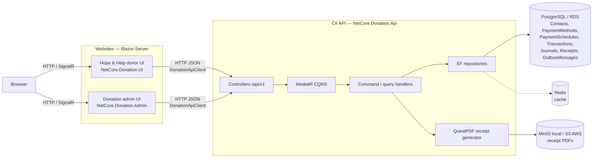
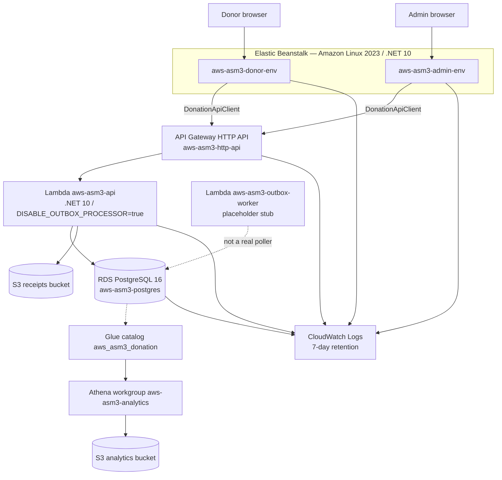
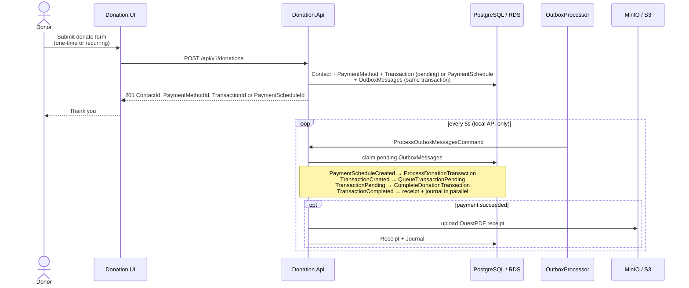
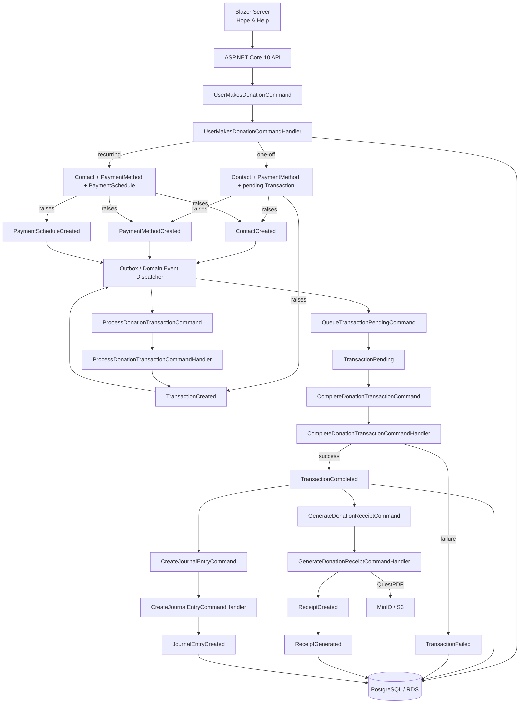
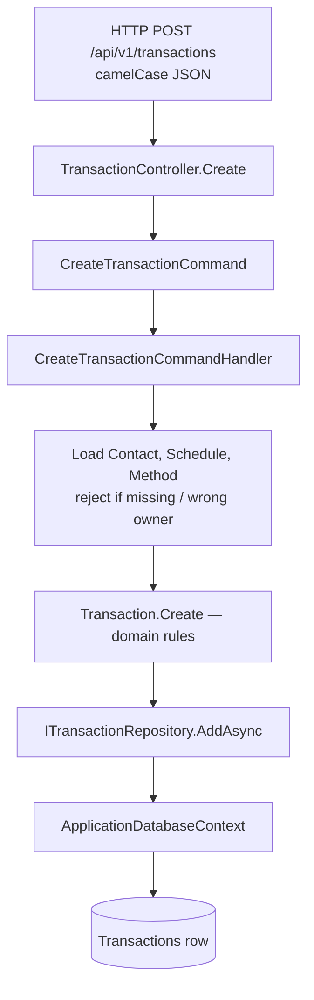

# Data flow — browser to API to AWS

Hope and Help is a simulated donation system. Auth is not enabled. Email and SMS are logged only (no SES/SNS). There is no `Donation` entity: recurring intent is a `PaymentSchedule`; a one-off gift is a `Transaction` with no schedule.

Code types keep the Country-style `*DomainEvent` suffix (`TransactionCompletedDomainEvent`). Diagrams use the short names (`TransactionCompleted`).

Local development (Aspire) uses PostgreSQL, Redis, and MinIO. AWS Academy (COSC29800 A3) uses API Gateway + Lambda, RDS PostgreSQL, S3, and Elastic Beanstalk. The CQRS pipeline and tables are the same in both environments.

## 1. Website → C# API → persistence

Browsers talk to Blazor Server. Each site calls the API over HTTP (`DonationApiClient`). Donation rows go to PostgreSQL. Receipt PDF bytes go to object storage; receipt metadata stays in `Receipts`. Redis is beside the write path (cache), not the system of record.



### AWS hosting



AWS Academy `voclabs` cannot create CloudFront distributions (`cloudfront:CreateDistribution` denied). UIs are reached on Elastic Beanstalk CNAMEs. The request Lambda does not poll the outbox; seed/migration drains it. Live donor gifts stay pending until a real worker exists.

## 2. Donate click — one command, then outbox

The public donate form posts **one** command: `POST /api/v1/donations` → `UserMakesDonationCommand`. That write creates or reuses a Contact (by email) and always creates a PaymentMethod.

- **One-time gift:** creates a pending `Transaction` with no payment schedule and raises `TransactionCreated`.
- **Recurring gift:** creates a `PaymentSchedule` and raises `PaymentScheduleCreated`. The outbox then opens the first transaction.

A hosted poller (`OutboxProcessor`, every 5s) publishes pending outbox rows, then MediatR handlers send the **next command**. Generating later recurring charges is out of scope: a recurring donate records one schedule and one first transaction.

The six REST writes (`POST /contacts`, `/payment-methods`, `/payment-schedules`, `/transactions`, `/journals`, `/receipts`) still exist for admin / stepwise APIs. The donor UI no longer uses them for a gift.



Admin **reads** the same tables (`GET /contacts`, `/transactions`, `/journals`, `/receipts`) and downloads PDFs with `Accept: application/pdf`. Trace outbox rows with `GET /api/v1/outbox-messages?correlationId=` or `?idempotencyKey=`.

## 3. Donation CQRS pipeline

There is no `Donation` entity. **PaymentSchedule** is recurring intent only. A one-off gift is a `Transaction` with no schedule. Journal stays in the same PostgreSQL database (not a separate ledger DB).



### Command flow

```text
UserMakesDonationCommand
        │
        ▼
UserMakesDonationCommandHandler
        │
        ├── one-off  → Contact + PaymentMethod + pending Transaction
        │                 ├── ContactCreated (new contacts only)
        │                 ├── PaymentMethodCreated
        │                 └── TransactionCreated
        │
        └── recurring → Contact + PaymentMethod + PaymentSchedule
                          ├── ContactCreated (new contacts only)
                          ├── PaymentMethodCreated
                          └── PaymentScheduleCreated
                                │
                                ▼
                    ProcessDonationTransactionCommand
                                │
                                ▼
                       TransactionCreated
                                │
                                ▼
                    QueueTransactionPendingCommand
                                │
                                ▼
                       TransactionPending
                                │
                                ▼
                    CompleteDonationTransactionCommand
                                │
                          ┌─────┴─────┐
                          ▼           ▼
              TransactionCompleted  TransactionFailed
                          │
                     ┌────┴─────┐
                     ▼          ▼
              GenerateDonation  CreateJournalEntry
              ReceiptCommand    Command
                     │          │
                     ▼          ▼
              ReceiptCreated    JournalEntryCreated
              ReceiptGenerated
```

Production API completion uses `SucceededDonationTransactionOutcome` (always succeed). Seed uses `RandomDonationTransactionOutcome` (about 50/50 fail). Failure stops: no receipt, no journal.

### Minimal commands

```text
UserMakesDonationCommand
ProcessDonationTransactionCommand
QueueTransactionPendingCommand
CompleteDonationTransactionCommand
GenerateDonationReceiptCommand
CreateJournalEntryCommand
```

### Minimal domain events

```text
ContactCreated
CountryCreated
PaymentMethodCreated
PaymentScheduleCreated
TransactionCreated
TransactionPending
TransactionCompleted
TransactionFailed
ReceiptCreated
ReceiptGenerated
JournalEntryCreated
```

### Aggregate / state (as implemented)

```text
PaymentMethod            ← DisplayName + PaymentType
PaymentSchedule          ← recurring intent only (interval is never one-off)
 ├── Contact
 ├── PaymentMethod
 └── Transaction         ← first charge for the schedule
Transaction              ← one-off gift has no schedule
       │
       ├── Pending
       ├── Succeeded     ← TransactionCompleted
       └── Failed        ← TransactionFailed
```

Direct `Transaction.Create` (the six-call REST path) still defaults status to **Succeeded** so admin/stepwise APIs are not stuck pending.

`TransactionCompleted` triggers **two independent application commands in parallel** (separate DI scopes, so they do not share a DbContext):

```text
TransactionCompleted
       │
       ├──────────────► GenerateDonationReceiptCommand  → QuestPDF → S3/MinIO
       │
       └──────────────► CreateJournalEntryCommand
```

## 4. Inside one API request (stepwise REST still)

Every create/update/delete on the existing six resources still follows Country-style CQRS: controller → MediatR command → handler → domain entity → EF repository → PostgreSQL. Query DTOs are kebab-case (`transaction-id`, `do-not-email`); write bodies are camelCase.



Donate is different: `POST /api/v1/donations` only writes the first aggregates + outbox; later writes happen on later poller cycles.

## Report notes

| In these diagrams | Not in this path |
|---|---|
| Two Blazor sites → one API → Postgres | JWT / IdentityServer |
| One donate command + transactional outbox | Payment processor / webhooks |
| Receipt bytes in S3 (or MinIO locally), metadata in `Receipts` | SES / SNS notify (logged only) |
| Journal in the **same** Postgres as donations | Separate ledger database |
| Recurring = flag + interval on the schedule | Generating later recurring transactions |
| Redis only beside the write path | Browser talking to the API directly |
| Production always succeeds; seed is 50/50 | Real gateway result |
| API Gateway + Lambda + EB + RDS | CloudFront (blocked on AWS Academy) |
