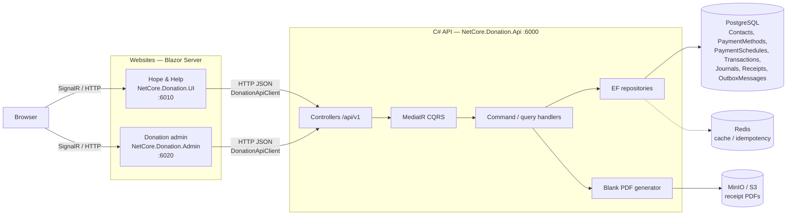
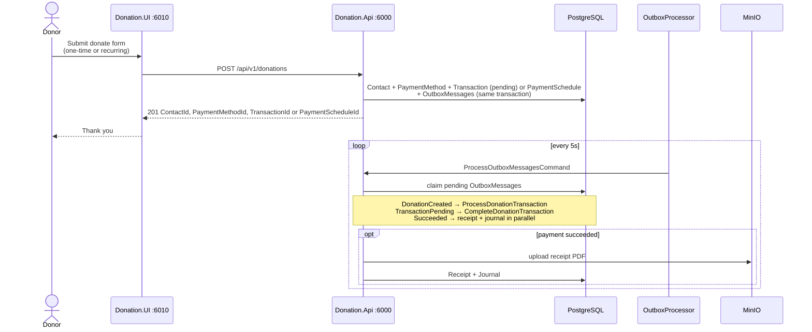
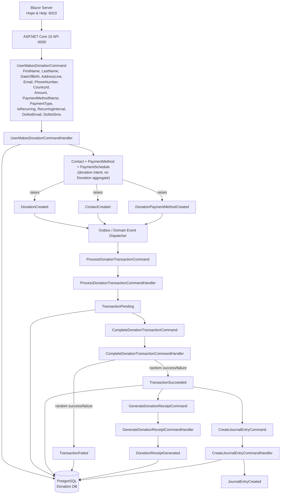
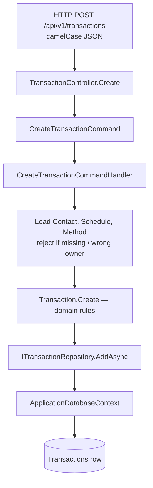

# Data flow — website to C# API to database

Local architecture for the COSC29800 donation system. Auth is not enabled. Email/SMS notification is not wired yet.

Use the mermaid blocks below in the report (GitHub, VS Code, Word via a mermaid add-in, or export from [mermaid.live](https://mermaid.live)).

Code types keep the Country-style `*DomainEvent` suffix (`DonationCreatedDomainEvent`). Diagrams use the short names (`DonationCreated`).

## 1. Website → C# API → database

Browser talks to Blazor Server. The **server** calls the API over HTTP (`DonationApiClient`). Donation rows go to PostgreSQL. Receipt PDF bytes go to MinIO; receipt metadata stays in `Receipts`. Redis is beside the write path (cache / idempotency), not the system of record.



## 2. Donate click — one command, then outbox

The public donate form posts **one** command: `POST /api/v1/donations` → `UserMakesDonationCommand`. That write creates Contact (or reuses by email) and PaymentMethod.

- **One-time gift:** creates a pending `Transaction` with no payment schedule and raises `TransactionPending`.
- **Recurring gift:** creates a `PaymentSchedule` (interval is never one-off) and raises `DonationCreated`. The outbox then opens the first transaction.

A hosted poller (`OutboxProcessor`, every 5s) publishes pending outbox rows, then MediatR handlers send the **next command**. Generating later recurring charges is out of scope: a recurring donate records one schedule and one first transaction.

The six REST writes (`POST /contacts`, `/payment-methods`, `/payment-schedules`, `/transactions`, `/journals`, `/receipts`) still exist for admin / stepwise APIs. The donor UI no longer uses them for a gift.



Admin **reads** the same tables (`GET /contacts`, `/transactions`, `/journals`, `/receipts`) and downloads PDFs with `Accept: application/pdf`. Trace outbox rows with `GET /api/v1/outbox-messages?correlationId=` or `?idempotencyKey=`.

## 3. Donation CQRS pipeline (POC)

There is no `Donation` entity. **PaymentSchedule** is recurring intent only. A one-off gift is a `Transaction` with no schedule. Journal stays in the same PostgreSQL database (not a separate ledger DB).



### Command flow

```text
UserMakesDonationCommand
        │
        ▼
UserMakesDonationCommandHandler
        │
        ▼
Contact + PaymentMethod + PaymentSchedule
        │
        ├── DonationCreated          (IsRecurring, RecurringInterval)
        ├── ContactCreated           (new contacts only)
        └── DonationPaymentMethodCreated
                │
                ▼
        PostgreSQL + OutboxMessages
                │
                ▼
ProcessDonationTransactionCommand
                │
                ▼
ProcessDonationTransactionCommandHandler
                │
                ▼
       TransactionPending
                │
                ▼
CompleteDonationTransactionCommand
                │
                ▼
CompleteDonationTransactionCommandHandler
                │
          ┌─────┴─────┐
          │            │
          ▼            ▼
TransactionSucceeded  TransactionFailed
          │
     ┌────┴─────┐
     │          │
     ▼          ▼
Generate       Create
Donation       JournalEntry
Receipt        Command
Command
     │          │
     ▼          ▼
Receipt       Journal
Generated     EntryCreated
```

One-time gifts skip `DonationCreated` and open a pending transaction immediately. Recurring gifts raise `DonationCreated` on a schedule; later recurring charges are out of scope.

### Minimal commands

```text
UserMakesDonationCommand
ProcessDonationTransactionCommand
CompleteDonationTransactionCommand
GenerateDonationReceiptCommand
CreateJournalEntryCommand
```

### Minimal domain events

```text
DonationCreated
ContactCreated
DonationPaymentMethodCreated
TransactionPending
TransactionSucceeded
TransactionFailed
DonationReceiptGenerated
JournalEntryCreated
```

### Aggregate / state (as implemented)

```text
PaymentMethod            ← DisplayName + PaymentType (used by schedule or one-off txn)
PaymentSchedule          ← recurring intent only (PaymentType + interval)
 ├── Contact
 ├── PaymentMethod
 └── Transaction         ← first charge for the schedule
Transaction              ← one-off gift has no schedule
       │
       ├── Pending
       ├── Succeeded
       └── Failed
```

Direct `Transaction.Create` (the six-call REST path) still defaults status to **Succeeded** so admin/stepwise APIs are not stuck pending.

### POC CQRS distinction

```text
COMMAND
   │
   ▼
Handler
   │
   ▼
Domain / aggregate
   │
   ▼
DOMAIN EVENT  →  Outbox  →  MediatR
   │
   ▼
Next COMMAND
```

`TransactionSucceeded` triggers **two independent application commands in parallel** (separate DI scopes, so they do not share a DbContext):

```text
TransactionSucceeded
       │
       ├──────────────► GenerateDonationReceiptCommand
       │
       └──────────────► CreateJournalEntryCommand
```

That is CQRS + MediatR + DDD domain events without a payment-provider webhook. Completion uses `IDonationTransactionOutcome` (50/50 random in the API). Failure stops: no receipt, no journal.

## 4. Inside one API request (stepwise REST still)

Every create/update/delete on the existing six resources still follows Country-style CQRS: controller → MediatR command → handler → domain entity → EF repository → PostgreSQL. Query DTOs are kebab-case (`transaction-id`, `do-not-email`); write bodies are camelCase.



Donate is different: `POST /api/v1/donations` only writes the first aggregates + outbox; later writes happen on later poller cycles.

## Report notes

| In these diagrams | Not in this path yet |
|---|---|
| Two Blazor sites → one API → Postgres | JWT / Identity |
| One donate command + transactional outbox | Payment processor / webhooks |
| Receipt bytes in MinIO, metadata in `Receipts` | SES / SNS notify |
| Journal in the **same** Postgres as donations | Separate ledger database |
| Recurring = flag + interval on the schedule | Generating later recurring transactions |
| Redis only beside the write path | Browser talking to the API directly |
| Random success/failure for POC | Real gateway result |

Later cloud swap (same CQRS and tables): see [`AWS_RUBRIC_ALIGNMENT.md`](AWS_RUBRIC_ALIGNMENT.md) — **API Gateway + Lambda**, **RDS**, **S3**, **Elastic Beanstalk** (+ optional CloudFront / ElastiCache / Athena). Keep the outbox table; run the poller as Lambda. SES/SNS/EventBridge/CloudWatch may support the demo but are weak or zero for Criteria 1–5 marks.
